=================
Quick Start Guide
=================

AWS - Setup IAM Policies and Roles
=================
To follow best AWS best practices, we are going to utilize **roles only**. This guide does not involve the use of long term access keys. 

:Note: You will need to create **one policy** and **two roles** for the audit collection to work. 

The permissions on the first role will allow your EC2 instance to use STS and assume the desired auditing roles.
The second role will allow the collection of data. In other words, the first role, will assume the second role. The second role, will have the rights to collect the data of interest.

To visualize this setup, please take a look at the following diagram to illustrate the process.

.. image:: images/aws/role_setup_diagram.png

:Note: The **policy and first role below** is only created **in one account**: your auditor source AWS account.

Create an "assume" Policy for your auditor "assume" Role
-------------

:Select: ``Create Policy``. This will be used by your first role.

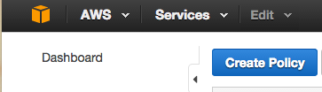

:Select: ``Create your own policy``

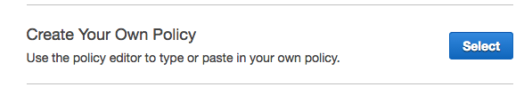

:Name your new policy: "iamp_ec2_awsdit_assume_policy" along with the following ``json code``

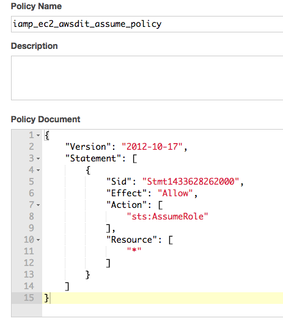

:If you want to copy/paste: Here is the JSON text.

.. code-block:: json

  {
    "Version": "2012-10-17",
    "Statement": [
        {
            "Sid": "Stmt1433628262000",
            "Effect": "Allow",
            "Action": [
                "sts:AssumeRole"
            ],
            "Resource": [
                "*"
            ]
        }
    ]
  }

Your new policy will be created. ``Note the given name``.

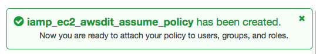

Create the "assume" Role and attach the new "assume" Policy
-------------

:AGAIN: **this role** is only created **in one account**: your auditor source AWS account.

:Select: ``Create New Role``. This role will be assigned to your auditing EC2 and use the STS service to assume the desired auditing roles

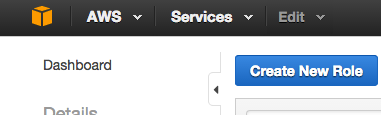

:Role Name: name your role ``assume_ec2_awsdit_roles``.

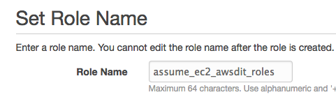

:Role Type: should be set to ``AWS Service Roles`` and ``Amazon EC2``

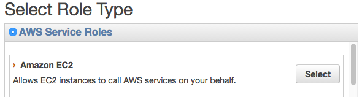

:Attach your newly created policy: ``iamp_ec2_awsdit_assume_policy``

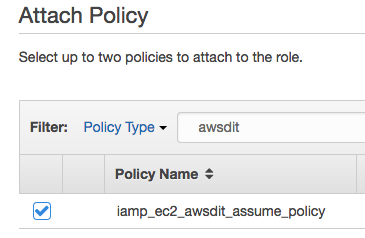

Create Your Auditing Role - "awsdit-role"
-------------

:NOTE: **YOU WILL REPEAT THIS STEP FOR EVERY AWS ACCOUNT THAT YOU WANT TO GRANT ACCESS**

This role will grant a trust relationship to your first role. You are granting the first role the rights to assume this role.

:Select: ``Create New Role``.

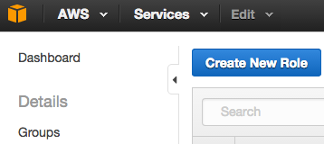

:Role Name: Set your role name to ``awsdit-role``

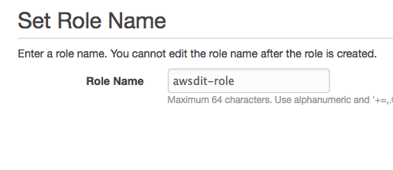

:Role Type: Here you will select ``Role for Cross-Account Access`` and select the option ``Provide access between AWS accounts you own``

:NOTE: This is not to grant access to 3rd party accounts. 

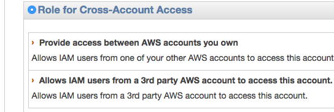

:Enter: your ``12-digit AWS Auditor Source Account Number`` goes here. 

:NOTE: this is the source account that you are trusting to access your other accounts. This is known as cross account access.

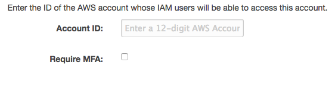

:Attach Policy: You should only grant ``ReadOnlyAccess`` from your list of available policy options. 

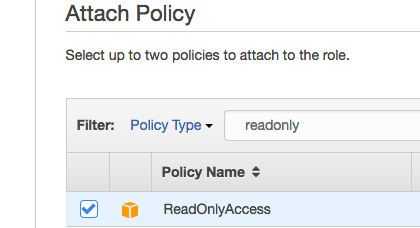

:Review and Submit: After verify, submit.

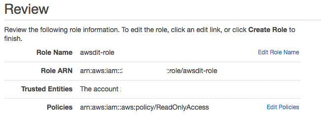

Trust Relationship ``Between`` Your Roles
-------------

:THE BELOW SECTION IS WHERE YOU ARE RESTRICTING THE TRUST ACCESS TO YOUR FIRST ROLE: **awsdit-role** will trust **assume_ec2_awsdit_roles** 

:YOU WILL REPEAT THIS STEP FOR EVERY AWS ACCOUNT THAT YOU WANT TO GRANT ACCESS: You will need the full **arn** path for the role that you are trusting. 

Go to ``IAM > Role > assume_ec2_aswdit_roles`` and copy its ARN

**"arn:aws:iam::<account-number>:role/assume_ec2_awsdit_roles"**

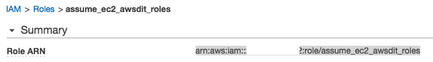

:After you copy your trusting ARN: Go back to ``IAM > Role > awsdit-role`` and select: 

**"Edit Trust Relationship"**

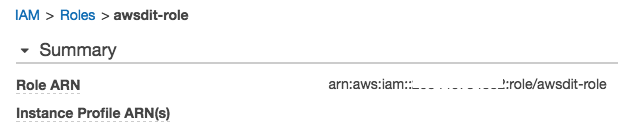

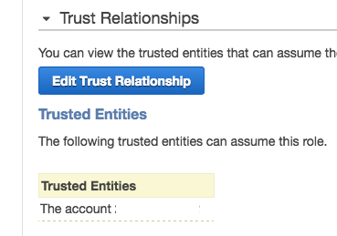

:Old JSON Code Values: Edit your original json values on the trust relationship

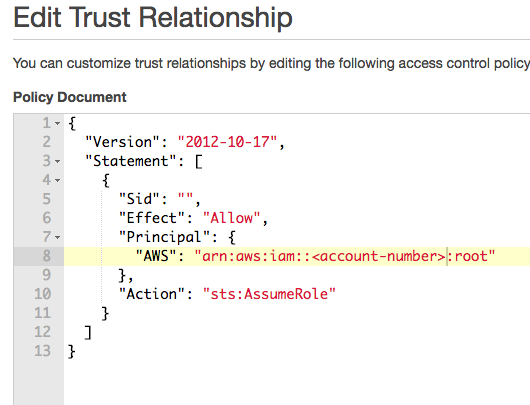

:To NEW json Code Values: Paste your assume role ARN here. 

.. code-block:: json

  {
  "Version": "2012-10-17",
  "Statement": [
    {
      "Sid": "",
      "Effect": "Allow",
      "Principal": {
        "AWS": "arn:aws:iam::<12-digit-AWS-Account-Number>:role/assume_ec2_awsdit_roles"
      },
      "Action": "sts:AssumeRole"
    }
  ]
  }

Testing Your Setup - AWS Roles
-------------

Navigate to: ``EC2 > Instances > Launch Instance``. You will deploy your auditor EC2 with the ``assume`` role.

Please choose the ``Amazon Linux`` AMI. 

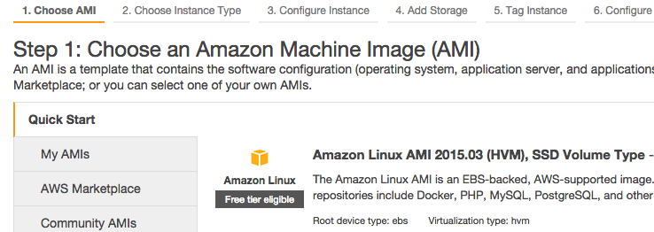

:Under "Configure Instance Details > IAM role": select ``assume_ec2_awsdit_roles`` 

Once the instance is created with this role assignment, it will have the ability to assume the **awsdit-role** across the accounts where you have granted a trust to ``assume_ec2_awsdit_roles``

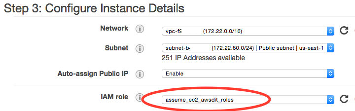

Once your instance is deployed with the ``assume_ec2_awsdit_roles``, do a quick test to check if your setup is correct, you can upload the following Python test code to your auditor EC2 instance:

.. code-block:: python

  #!/usr/bin/env python

  # Example code to assume a role within a sitting account

  import re
  import boto
  from boto.utils import get_instance_metadata

  #local call to instance metadata and extract account number from iam info
  account_number = str(re.split(":",(get_instance_metadata()['iam']['info']['InstanceProfileArn']))[4])

  #or to test remote aws account
  #account_number = '<12-digit-aws-account-number>'

  # make sts call
  sts = boto.connect_sts()

  desired_role = 'awsdit-role'
  role_description = 'awsditRoleTest'

  role = sts.assume_role('arn:aws:iam::{0}:role/{1}'.format(account_number, desired_role), role_description)

  ## make a connection to an AWS service such as below, and continue with your normal code.
  #EC2
  ec2 = boto.connect_ec2(role.credentials.access_key, role.credentials.secret_key, security_token=role.credentials.session_token)

:Note: If you get no errors, your setup was successful.

