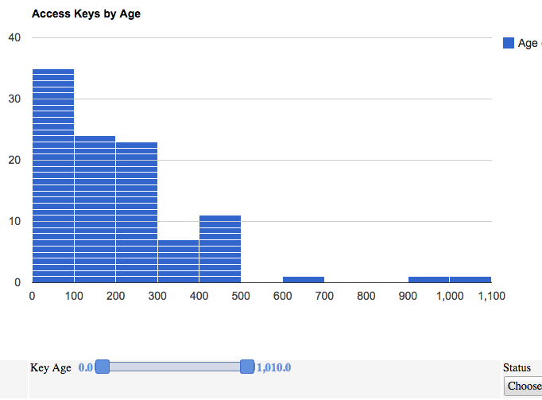
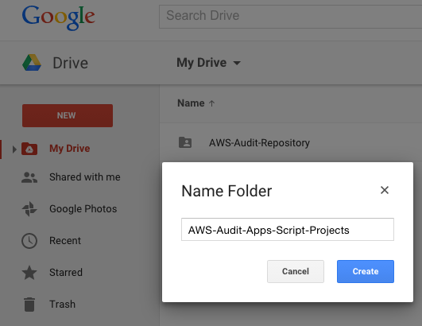
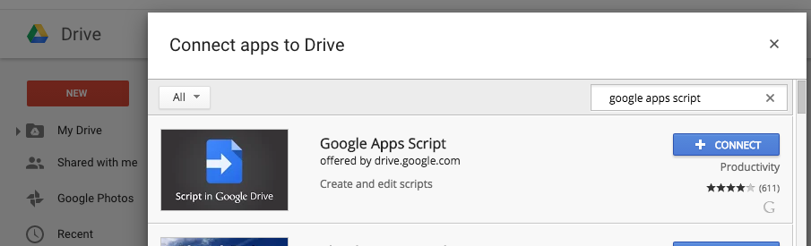
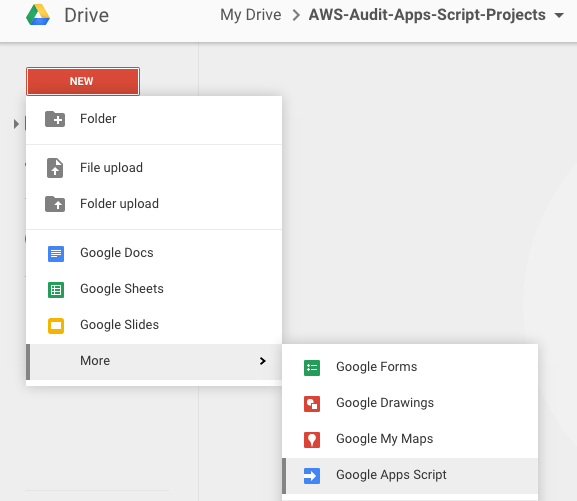

=================
Quick Start Guide
=================

Google Apps Script
=================

|ImageLink|_

.. _ImageLink: https://goo.gl/qLTBFy

We are going to utilize **Google Apps Script** to represent all data collected to the end users. If you are not familiar with Google Apps Script, here is an excellent reference book to get you started: https://library.oreilly.com/book/0636920032557/google-apps-script-2nd-edition/toc

The basic idea is to use the Google Apps Script platform to iterate through your data files repository, pull a file of interest and present the data to your staff in a familiar and easy way: **spreadsheets** with **filter options!**

**Here is a SAMPLE for illustration:** https://goo.gl/qLTBFy

Google Drive Folder for Google Apps Scripts
-------------

:Create a Google Apps Script Folder: Create a Google Drive folder to host all your Apps Script files.

:Create your first Apps Script Project: Go into your newly created folder and create a new apps script project.

From here, click the “New” button, "More" and choose “Google Apps Script.” If you don’t have the Script App, it can be installed by clicking the “Connect more apps” button at the bottom of the “Create” menu and searching for “google apps script.”

Google Apps Script Repository
=================
Since Google Apps Scripts code can not be hosted out of Github, we have shared a Google Drive folder to host all the Google Apps Script code related to this project. You will find different apps scripts for different purposes. 

Code Repository 
-------------
- Login to https://drive.google.com 
- Visit the apps script repository link: https://goo.gl/ONfyaB . If you want the repository to appear under the **"My Drive"** section of your Google Drive area, then select **"Add to Drive"**.
- Go into "AWS-Audit-Apps-Script-Projects" 
- select "Apps-Script-Test" and "Make a Copy". 

Once you **make a copy of each script**, rename each, and publish them only to your internal team. If you are not sure how this is done, refer to the recommended book: https://library.oreilly.com/book/0636920032557/google-apps-script-2nd-edition/toc

Test Script
-------------

:Project Name: **Apps-Script-Test**
:Apps Script Code: https://goo.gl/XxfKmA
:Sheet Source: https://goo.gl/8HQ5pL
:Published Sample: https://goo.gl/sLAAMl - QR Code: https://goo.gl/sLAAMl.qr

- Your First Test Script!

Amazon AWS Related
=================

AWS - IAM
-------------

:Project Name: **AWS-IAM-User-Access-Key-Inventory**
:Apps Script Code: https://goo.gl/nJOOCU
:EC2 Script Code: https://goo.gl/KSpKW6
:Sheet Source: https://goo.gl/4rCC4J
:Published Sample: https://goo.gl/qLTBFy - QR Code: https://goo.gl/qLTBFy.qr

How can this help?

- Inventory Access Keys from All Accounts
- Filter Access Keys by Age
- Filter Access Keys Older than X days
- Filter Access Keys by Account
- Filter Access Keys by Username
- Filter Active vs Inactive Access Keys
- Filter Access Keys by Service Name
- Filter Access Keys by Days Since Last Used

:Project Name: **AWS-IAM-Users-Inventory**
:Apps Script Code: https://goo.gl/hC9uFy
:EC2 Script Code: https://goo.gl/oZBx2S
:Sheet Source: https://goo.gl/t3iXPv
:Published Sample: https://goo.gl/nBlhQy - QR Code: https://goo.gl/nBlhQy.qr

How can this help?

- Inventory Users from All Accounts
- Filter by Account
- Filter Info by Username
- Filter Users by Password Set Values: (yes/no)
- Filter by Password Last Used
- Filter by MFA Set Values: (true/false)
- Filter by Group Memberships
- Display Active Access Keys per User

:Project Name: **AWS-IAM-User-Signing-Certs**
:Apps Script Code: https://goo.gl/5PGtK2
:EC2 Script Code: https://#
:Sheet Source: https://goo.gl/nBBWQC
:Published Sample: https://goo.gl/LQQ23a - QR Code: https://goo.gl/LQQ23a.qr

How can this help?

- Inventory Signing Certs from All Accounts
- Filter Signing Certs by Username
- Filter Signing Certs by Active Status
- Filter Signing Certs by Age

:Project Name: **AWS-IAM-Inline-User-Policies**
:Apps Script Code: https://goo.gl/Tw28HV
:EC2 Script Code: https://goo.gl/UKVnE0
:Sheet Source: https://goo.gl/ndvz30
:Published Sample: https://goo.gl/s8gLrt - QR Code: https://goo.gl/s8gLrt.qr

How can this help?

- Inventory ``Inline User Policies`` from All Accounts
- Filter by Account
- Filter by Assigned Username
- Filter by Policy Name
- Filter by Policy Statement

:Project Name: **AWS-IAM-Inline-Group-Policies**
:Apps Script Code: https://goo.gl/S2LcN1
:EC2 Script Code: https://goo.gl/g4T68m
:Sheet Source: https://goo.gl/CjsrqS
:Published Sample: https://goo.gl/pAHhdz - QR Code: https://goo.gl/pAHhdz.qr

How can this help?

- Inventory ``Inline Group Policies`` from All Accounts
- Filter by Account
- Filter by Assigned Group Name
- Filter by Policy Name
- Filter by Policy Statement

:Project Name: **AWS-IAM-Inline-Role-Policies**
:Apps Script Code: https://goo.gl/0zilnf
:EC2 Script Code: https://goo.gl/SWbMQS
:Sheet Source: https://goo.gl/BCmLHI
:Published Sample: https://goo.gl/scIYgp -QR Code: https://goo.gl/scIYgp.qr

How can this help?

- Inventory ``Inline Role Policies`` from All Accounts
- Filter by Account
- Filter by Role Type
- Filter by Role Name
- Filter by Policy Name
- Filter by Policy Statement

:Project Name: **AWS-IAM-Managed-Policies**
:Apps Script Code: https://goo.gl/YbxEe7
:EC2 Script Code: https://goo.gl/nGR9Mh
:Sheet Source: https://goo.gl/L2quAK
:Published Sample: https://goo.gl/8jeCSZ -QR Code: https://goo.gl/8jeCSZ.qr

How can this help?

- Inventory ``Managed Policies`` from All Accounts
- Filter by Account
- Filter by Attachment Level (role, group, user)
- Filter by Attachment Object Name (role, group, user)
- Filter by Policy Name
- Filter by Policy Statement

AWS - EC2
-------------

:Project Name: **Security-Groups-Inventory**
:Apps Script Code: https://goo.gl/Jyt1Ak
:EC2 Script Code: https://goo.gl/7iFRhb
:Sheet Source: https://goo.gl/mRCdKy
:Published Sample: https://goo.gl/OSlJPs

How can this help?

- Inventory Security Groups from All Accounts
- Inventory Security Groups from All Regions
- Filter SGs by Account or Region
- Filter SGs by VPC
- Filter SGs by EC2 Associations
- Filter SGs by Security Group ID
- Filter SGs by Security Group Name
- Filter SGs by Production Ready Status

:Project Name: **Security-Group-Rule-Sets-Inventory**
:Apps Script Code: https://goo.gl/Zpzh5T
:EC2 Script Code: https://goo.gl/taah8g
:Sheet Source: https://goo.gl/W38jQQ
:Published Sample: https://goo.gl/w1GzZV

How can this help?

- Inventory Security Group Rule Sets from All Accounts
- Inventory Security Groups Rule Sets from All Regions
- Filter Rule Sets by Account or Region
- Filter Rule Sets by VPC
- Filter Rule Sets by Source, Port, Protocol
- Filter Rule Sets by Security Group ID
- Filter Rule Sets by Security Group Name

:Project Name: **Security-Group-Rules-by-EC2**
:Apps Script Code: https://goo.gl/jIac8d
:EC2 Script Code: https://goo.gl/P0oIWg
:Sheet Source: https://goo.gl/DzrBzP
:Published Sample: https://goo.gl/vZz8ev

How can this help?

- Inventory of All Security Group Rules by Each EC2 Instance
- Filter by Account or Region
- Filter by VPC
- Filter by Source and/or Port, Protocol
- Filter by EC2-Name, EC2-Id and or EC2-IP address
- Filter by Security Group ID
- Filter by Security Group Name

:Project Name: **Security-Group-Rules-by-RDS**
:Apps Script Code: https://goo.gl/NHVx5o
:EC2 Script Code: https://goo.gl/Sqbgw1
:Sheet Source: https://goo.gl/QCxFS6
:Published Sample: https://goo.gl/1BWH2v

How can this help?

- Inventory of All Security Group Rules by RDS Instance
- Filter by Account or Region
- Filter by VPC
- Filter by Source and/or Port
- Filter by RDS-Id
- Filter by Security Group ID
- Filter by Security Group Name
- Filter by Public Access (true/false)

:Project Name: **Security-Group-Rules-by-ELB**
:Apps Script Code: https://goo.gl/hUSgna
:EC2 Script Code: https://goo.gl/xZSFcy
:Sheet Source: https://goo.gl/ezYiDU
:Published Sample: https://goo.gl/NOOOVg

How can this help?

- Inventory of All Security Group Rules by Each ELB Instance
- Filter by Account or Region
- Filter by VPC
- Filter by Source and/or Port
- Filter by ELB-Name
- Filter by IP Address
- Filter by Scheme (public/internal)
- Filter by Security Group ID
- Filter by Security Group Name

:Project Name: **Security-Group-Rules-by-EC2-with-Roles**
:Apps Script Code: https://goo.gl/W330Gn
:EC2 Script Code: https://goo.gl/XOTpLU
:Sheet Source: https://goo.gl/1kLaR5
:Published Sample: https://goo.gl/3rQvkl

How can this help?

- Inventory of All Security Group Rules by Each EC2 Instace with Role Assigments
- Filter by Account or Region
- Filter by VPC
- Filter by Role Association
- Filter by Source and/or Port
- Filter by EC2-Name, EC2-Id, EC2-State and or EC2-IP address
- Filter by Security Group ID
- Filter by Security Group Name

AWS - S3
-------------

:Project Name: **S3-Bucket-Inventory**
:Apps Script Code: https://goo.gl/22DT79
:EC2 Script Code: https://goo.gl/OTZsBv
:Sheet Source: https://goo.gl/ieauc4
:Published Sample: https://goo.gl/gnDkRQ

How can this help?

- Inventory S3 Buckets from All Accounts
- Inventory Total Buckets per Account
- Filter by Account
- Filter by Bucket Name
- Filter by Site
- Filter by Web Access (true/false)

:Project Name: **S3-ACL-Bucket-Rule-Sets**
:Apps Script Code: https://#
:EC2 Script Code: https://goo.gl/phMj3E

How can this help?

- Inventory S3 ACL Bucket Rule Sets from All Accounts
- Inventory Total ACL Counts per Account
- Filter by Account
- Filter by Bucket Name
- Filter by Source
- Filter by Permission

:Project Name: **S3-Bucket-Level-Policies**
:Apps Script Code: https://#
:EC2 Script Code: https://goo.gl/h5XXDV

How can this help?

- Inventory S3 Bucket Level Policies from All Accounts
- Filter by Account
- Filter by Bucket Name
- Filter by Policy Statement

AWS - OPS
-------------

:Project Name: **OPS-EC2-Inventory**
:Apps Script Code: https://#
:EC2 Script Code: https://goo.gl/rJZnRj

How can this help?

- Inventory EC2s from All Accounts
- Inventory EC2s from All Regions
- Filter by Account or Region
- Filter by VPC
- Filter by EC2-Id
- Filter by EC2-Name
- Filter by EC2-Type
- Filter by EC2-State
- Filter by EC2 Private or Public IP
- Filter by EC2 Assigned ssh key-pair name

:Project Name: **OPS-RDS-Inventory**
:Apps Script Code: https://#
:EC2 Script Code: https://goo.gl/G0DRTf

How can this help?

- Inventory RDS Instances from All Accounts
- Inventory RDS Instances from All Regions
- Filter by Account or Region
- Filter by VPC
- Filter by RDS Address
- Filter by RDS-Type
- Filter by RDS IP
- Filter by RDS Listening Port
- Filter by Access Type (public/private)

:Project Name: **OPS-ELB-Inventory**
:Apps Script Code: https://#
:EC2 Script Code: https://goo.gl/L74Vzb

How can this help?

- Inventory ELBs from All Accounts
- Inventory ELBs from All Regions
- Filter by Account or Region
- Filter by VPC
- Filter by ELB Scheme (internal/internet-facing)
- Filter by ELB IP Address
- Filter by ELB DNS Name
- Filter by ELB Listen Ports
- Filter by ELB Backend Instance Ids
- Filter by ELB Backend Instance Listen Ports
- Filter by ELB Backend Instance Listen Protocols

:Project Name: **OPS-Key-Pair-Inventory**
:Apps Script Code: https://#
:EC2 Script Code: https://goo.gl/KbEvZU

How can this help?

- Inventory Key Pairs from All Accounts
- Inventory Key Pairs from All Regions
- Filter by Account or Region
- Filter by Key Name
- Filter by Key Fingerprint

Other Potential Use Cases
=================

Network Port Scans
-------------

:Project Name: **Port-Scan-Results**
:Apps Script Code: https://goo.gl/uaKIoI 
:EC2 Script Code: https://#
:Sheet Source: https://goo.gl/SpXOgj
:Published Sample: https://goo.gl/4FHVRV - QR Code: https://goo.gl/4FHVRV.qr

How can this help?

- Review Port Scan Results by Filtering by Service, Port or IP Address Info
