=================
Quick Start Guide
=================

Setup for Google Drive
=================
We are going to utilize **Google Drive** to store all data collected for later analysis. 

Setup the Google Drive API Client
-------------

:On your remote EC2: SSH into your new auditor EC2 and install the **Drive API Client Library for Python**.

https://developers.google.com/api-client-library/python/apis/drive/v2 for instructions.

But basically this can be done by the following commands from your EC2:

::

  $ sudo pip install --upgrade google-api-python-client
  $ sudo pip install --upgrade python-gflags
  # next line not required, but doesn't hurt to do a refresh of the AWS CLI tools
  $ sudo pip install --upgrade awscli
  $ sudo pip install --upgrade boto3

:On your local machine: You will need to do the same steps. Basically since this is the first time you will be authorizing the use of your Google Drive api app, it will prompt you, through a browser for authorization. Once you run through the authorization process once, you can migrate your google drive api code, auth secret and auth token to your auditor EC2. Once transfered it will continue to run on remote EC2 without prompting for authorization again.

::

  $ sudo pip install --upgrade google-api-python-client
  $ sudo pip install --upgrade python-gflags

:NOTE: THIS STEP IS DONE **ONLY ONCE**

Setup a Google Drive API Project
-------------

The first time our later test code runs, it will need a **client_secrets.json** file. 

Visit https://cloud.google.com/console#/project, to create a new project and enable the Google Drive API

:Create a project: After you click on the above link, go ahead and create a new project.

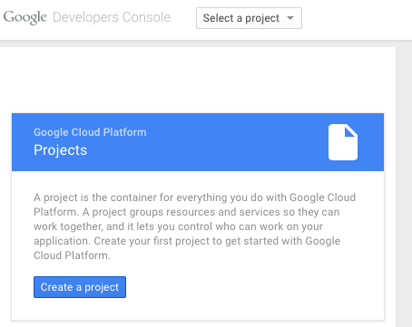

:Project Name: Name your project according to your standard requirements.

.. image:: images/create_gdrive_api_project_2.png

:API & auth > APIs: Search for Drive API and select ``Drive API``

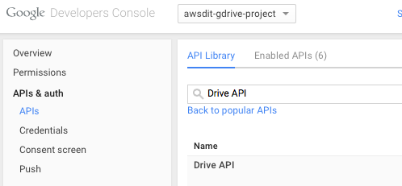

:API & auth > APIs: Once selected ``Enable API``

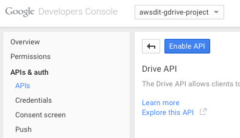

:API & auth > Credentials: Under Credentials ``Create new Client ID``

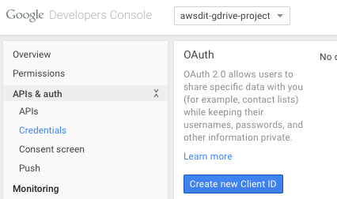

:Application Type: You will be creating an **Installed application** application type.

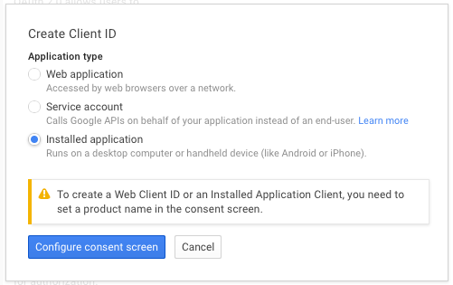

:Product Name: A ``Product name`` is required the first time an application is setup.

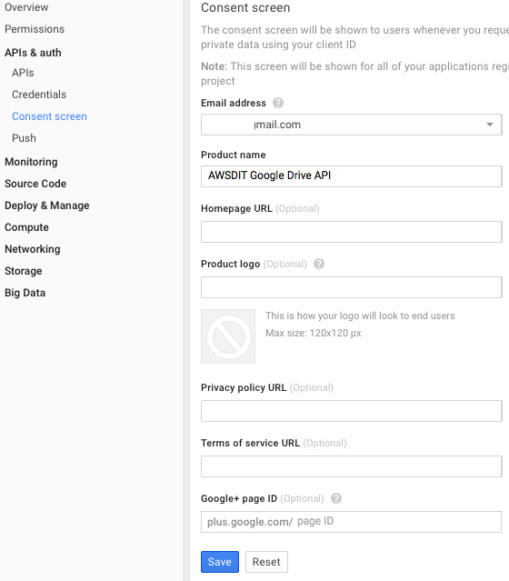

:Back to Application Type: You are then returned to ``Application type``. Select **Installed application** and ``Installed application type`` select **Other**.

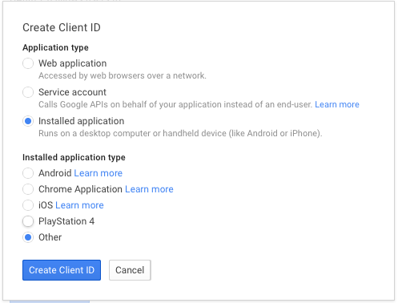

:Download JSON: After the secret is created, select **Download JSON** to download your secret.

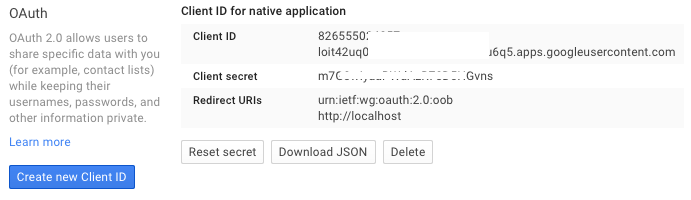

:Rename your secret file: After the download of the secret file, rename it to: **client_secret.json** and save it.

We will need this file later to test your connection to google drive.

Create a Google Drive Folder
-------------

:NOTE: **Will need to create a Google Drive folder to store your collected data**. 

The transfer of collected data from AWS to Google Drive will be conducted using the Google Drive API. After the Google Drive folder is created, we will need the Google Drive **folder-ID** along with your **client_secret.json** above.

:Create a New Folder: Go to drive.google.com and create a new folder. We will need the folder-ID later.

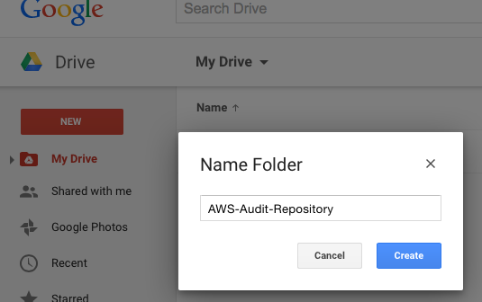

:Google Drive Settings: After the folder is created, Go to **Settings** and check the option: **Convert Uploads**.

:NOTE: The below step could be done at any time. This is so that Google Drive converts .csv files to Google sheets automatically.

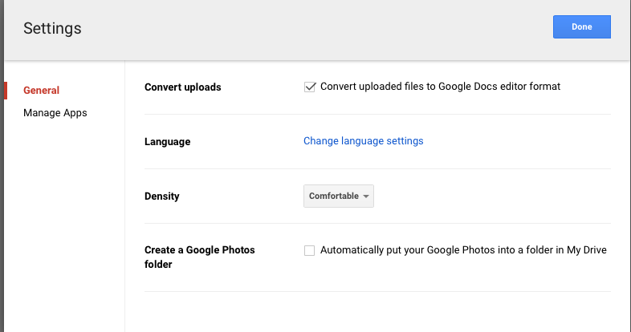

:Extract Folder-ID: After your folder has been created, you need to extract the folder-ID number. 

This can be extracted from the folder URL, as described below.

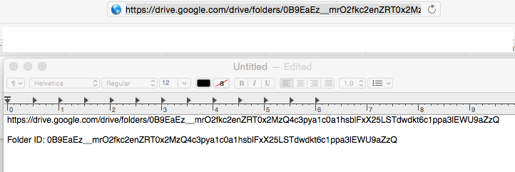

:NOTE: Deleting and Creating a new folder with the same name, will create a new folder-ID. 

Testing Your Google Drive Setup
-------------

:NOTE: THIS STEP IS DONE **ONLY ONCE**

:First Run: On your local machine, you will be authorizing the use of your Google Drive API app. 

When run for the first time it will prompt you, through a browser for authorization. 

Once you run through the authorization process once, you can migrate your Google Drive API code and secrets to your auditor EC2 and it will continue to run there without prompting for authorization again.

:Gather: Time to gather your Google Drive **folder-ID** and your **client_secret.json** file.

Under the google_drive folder: https://github.com/ndoit/awsdit/tree/master/google_drive locate directory **test-gdrive-api**

We will be using the file named: test-gdrive.py

.. code-block:: python

  #!/usr/bin/env python

  from apiclient.discovery import build
  from httplib2 import Http
  from oauth2client import file, client, tools
  from apiclient.http import MediaFileUpload
  import os

  CLIENT_SECRET = 'client_secret.json'
  SCOPES = 'https://www.googleapis.com/auth/drive.file'

  store = file.Storage('storage.json')
  creds = store.get()
  if not creds or creds.invalid:
      flow = client.flow_from_clientsecrets(CLIENT_SECRET, SCOPES)
      creds = tools.run_flow(flow, store, tools.argparser.parse_args([]))

  drive_service = build('drive', 'v2', http=creds.authorize(Http()))

:test-gdrive.py: When run successful for the first time, a new file gets created **storage.json**. This is your application token file.

You should be able to see the following authorization screens:

:Login: You will get the following screen if you have not authenticated to Google yet.

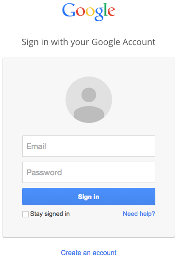

:Grant Access: grant access to your Google Drive API to access your Google Drive files

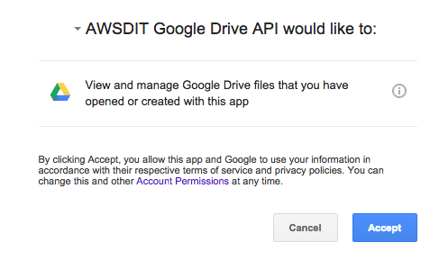

:Confirmation: You should see the following confirmation screen if successful authenticated.

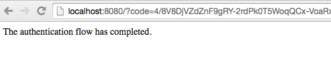

:Please Save in a secure restricted place: **client_secret.json**, **storage.json** and your **folder-ID**

**SSL Error** If you encounter the following ssl error when running your test code for the first time, this is most likely related to file permisions.

::

  Error
  ssl.SSLError: [Errno 185090050] _ssl.c:343: error:0B084002:x509 certificate routines:X509_load_cert_crl_file:system lib
  
:Solution: Try the following fix

::

  $find / -name cacerts.txt
  $sudo chmod 644 /Library/Python//2.7/site-packages/httplib2-0.9.1-py2.7.egg/httplib2/cacerts.txt

Test a File Transfer from the Google Drive API Client
-------------

:Create a .CSV test file: In your local folder **test-gdrive-api** where you have the files ``test-gdrive.py``, ``client_secret.json`` and  ``storage.json``, create a tiny csv file with the following content. The name does not matter. You can call it test-transfer.csv

::

  EC2Name,EC2ID,IPAddress
  awsdit-ec2,i-b9ad8a69,172.31.50.10

:Modify test-gdrive.py: Modify your python test code to conduct a file transfer test.

.. code-block:: python

  #!/usr/bin/env python

  from apiclient.discovery import build
  from httplib2 import Http
  from oauth2client import file, client, tools
  from apiclient.http import MediaFileUpload
  import os

  CLIENT_SECRET = 'client_secret.json'
  SCOPES = 'https://www.googleapis.com/auth/drive.file'

  store = file.Storage('storage.json')
  creds = store.get()
  if not creds or creds.invalid:
      flow = client.flow_from_clientsecrets(CLIENT_SECRET, SCOPES)
      creds = tools.run_flow(flow, store, tools.argparser.parse_args([]))

  drive_service = build('drive', 'v2', http=creds.authorize(Http()))
  
  # AWS-Audit-Report Folder-ID Goes Here
  body = {'title': '', 'mimeType': 'application/vnd.google-apps.spreadsheet',
    'parents': [{'kind': "drive#fileLink",'id': "Your-folder-ID-Goes-here"}]
  }

  dirpath = './'
  for f in os.listdir(dirpath):
    if f.endswith(".csv"):
        FILEPATH = dirpath + f
        FILENAME = f
        media_body = MediaFileUpload(FILEPATH, mimetype='text/csv', resumable=True)
        body['title'] = FILENAME
        # Insert a file
        file = drive_service.files().insert(body=body, media_body=media_body).execute()

:Execute test-gdrive.py: Save file and execute 
::

  $ ./test-gdrive.py

:A couple of seconds later: You should be able to see your test-transfer.csv file appear in your Google Drive Folder.

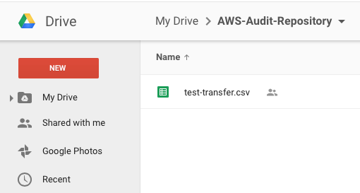

:Verify Content: At this point you should be able to open the .csv file to verify its content.

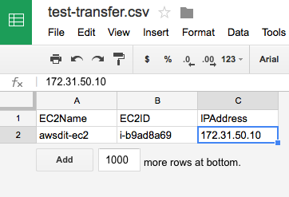

Last Step - Transfer Your Working Code Into Your AWS EC2
-------------

**Now that you have a working code, transfer it to your EC2**

:On your remote EC2: If yo haven't already, it is time to install the google-api-python-client in your remote EC2 instance. Here are the instructions again.

::

  $ sudo pip install --upgrade google-api-python-client
  $ sudo pip install --upgrade python-gflags
  # next line not required, but doesn't hurt to do a refresh of the AWS CLI tools
  $ sudo pip install --upgrade awscli
  $ sudo pip install --upgrade boto3

:Transfer Your Testing Directory: Compress **test-gdrive-api** where you have the files ``test-gdrive.py``, ``client_secret.json``, ``storage.json``, and ``test-transfer.csv``

Compress your testing direcotory and trasfer it to your auditor EC2. Compress, Transfer, Uncompress and Run

::

  [local]$ tar -zcvf test-gdrive-api.tar.gz test-gdrive-api/
    a test-gdrive-api
    a test-gdrive-api/client_secret.json
    a test-gdrive-api/storage.json
    a test-gdrive-api/test-gdrive.py
    a test-gdrive-api/test-transfer.csv
    
  [local]$ scp -i your-ssh-key.pem ec2-user@your-amazon-ec2.compute-1.amazonaws.com:
  
  [local]$ ssh -i your-ssh-key.pem ec2-user@your-amazon-ec2.compute-1.amazonaws.com
  
  [remote-ec2]$ tar -zxvf test-gdrive-api.tar.gz
  
  [remote-ec2]$ cd test-gdrive-api
  
  [remote-ec2]$ ./test-gdrive.py
  
:DONE: Verify that your .csv test file was transfered to your google drive folder.

**PownInsecure Warnings** When running the code.

Lately there has been encounters of the following warning message on newly created Amazon Linux EC2s:

::

  /usr/lib64/python2.7/dist-packages/Crypto/Util/number.py:57: 
  PowmInsecureWarning: Not using mpz_powm_sec.  
  You should rebuild using libgmp >= 5.

:Work around: Probably not the best work around, but you can get rid of those warning messages by doing the following.

::

  sudo vi /usr/lib64/python2.7/dist-packages/Crypto/Util/number.py

.. code-block:: python

  #after  "from Crypto.Util.py3compat import *"  insert the following two lines:
  import warnings
  warnings.filterwarnings('ignore')

If you run your test again, the warning messages related to this issue will be ignored. Again there must be a better solution to address the problem.
